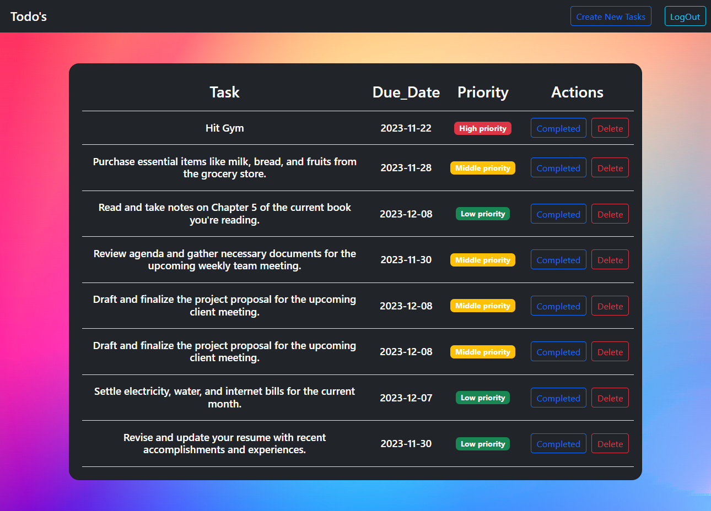
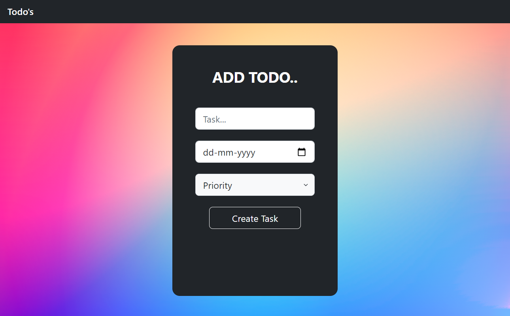
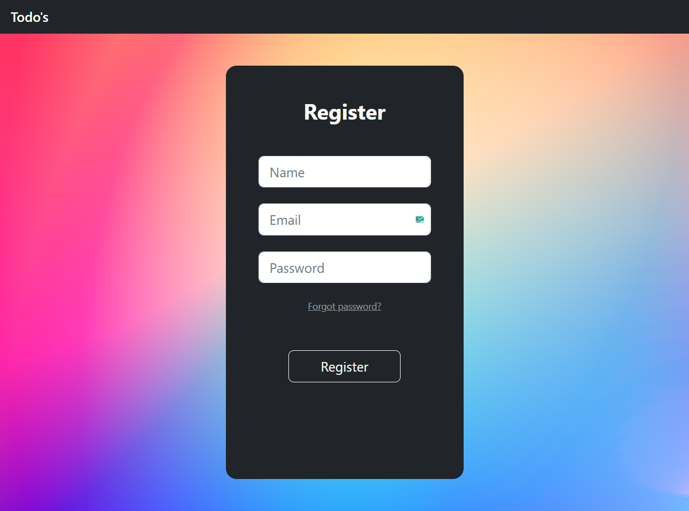
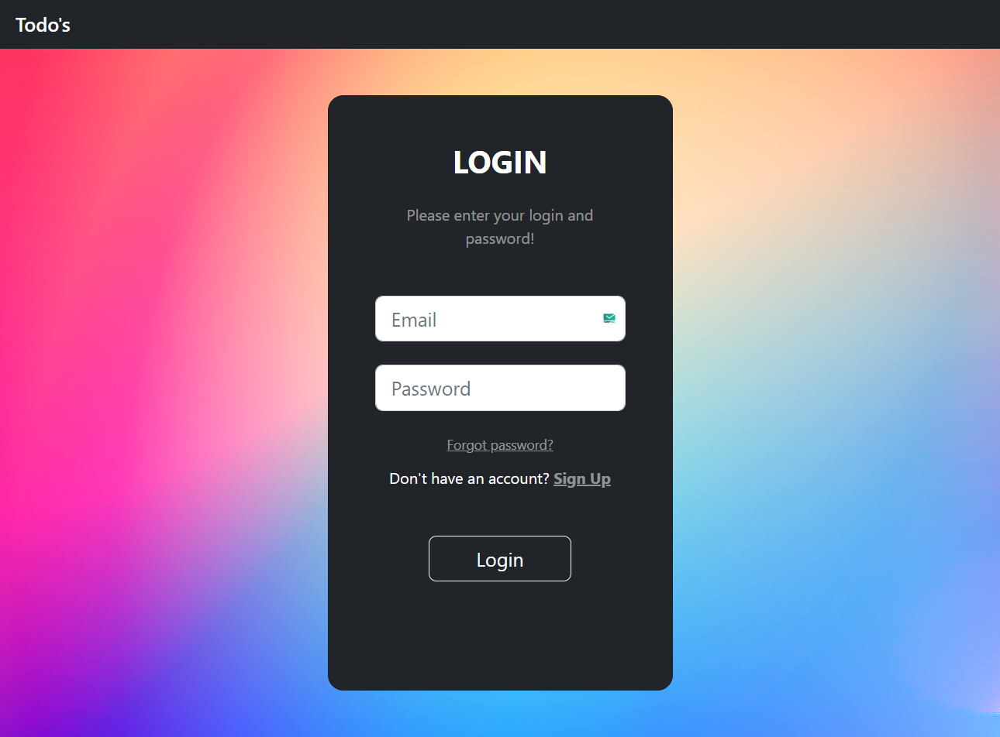

# Todo's
----
<div>
    
</div>


---
## Description:
<p>Todo's is an advanced to-do list application that not only streamlines task management but also ensures the security of your data. Developed using JSP, Servlets, JDBC, and MySQL, this application features robust backend authentication to protect your tasks and privacy. The modern Bootstrap 5 framework enhances the user experience with a responsive and sleek design.</p>

----
## Tools and technologies used

| Technology     | Version              |
|----------------|----------------------|
| JSP            | 2.2 +                |
| IDE            | STS/Eclipse Neon.3   |
| JDK            | 1.8 or later         |
| Apache Tomcat  | 8.5                  |
| JSTL           | 1.2.1                |
| Servlet API    | 2.5                  |
| MySQL          | mysql-connector-java-8.0.13.jar |

----
## Key Features:
- ***User-Friendly Interface:-*** Navigate through your tasks effortlessly with an intuitive and clean user interface.
- ***User Authentication:-*** Safeguard your tasks with a secure login system, allowing only authorized users to access and manage their to-do lists.
- ***Task Management:-*** Add, edit, and delete tasks to keep your to-do list organized and up to date.
- ***Priority Settings:-*** Prioritize your tasks by setting different levels of importance for effective time management.
- ***Due Dates:-*** Assign due dates to tasks to stay on top of deadlines and commitments.
- ***Database Integration:-*** Utilizing JDBC and MySQL, your tasks are securely stored and easily retrievable for a seamless user experience.
- ***Responsive Design:-*** Access your to-do list on various devices, thanks to the mobile-friendly Bootstrap 5 framework.

Todo's empowers users to enhance productivity, manage tasks efficiently while ensuring the confidentiality and integrity of their data through robust user authentication and stay organized in both personal and professional endeavors.

Feel free to customize this description based on specific features and functionalities your app offers! 


---

### create a database  using below DDL script:
- Create a database
  
  ```sql
  CREATE DATABASE 'TodoApp';
  USE TodoApp;
  ```

- Create a Task Table

  ```sql
  CREATE TABLE IF NOT EXISTS users (
      user_id  INT AUTO_INCREMENT NOT NULL,
      user_name varchar(50) NOT NULL,
      email_id varchar(220)  UNIQUE NOT NULL,
      encryptedPassword varchar(120) NOT NULL,
      saltVale varchar(120) NOT NULL,
      PRIMARY KEY (user_id),
      INDEX idx_user_salt (user_id, saltVale) -- Add a composite index
  );
  
  ```

  - Create a Task Table
  ```sql
   CREATE TABLE IF NOT EXISTS tasks (
       task_id INT AUTO_INCREMENT PRIMARY KEY,
       user_id INT,
       saltVale varchar(120),
       task_description VARCHAR(255),
       due_date DATE,
       task_priority INT,
       completed BOOLEAN DEFAULT FALSE,
       FOREIGN KEY (user_id, saltVale) REFERENCES users(user_id, saltVale)
   );

  ```
---
### Add Task
   
<div>
    
</div>
-----

### Register 
   
<div>
    
</div>

-----
### Login
   
<div>
    
</div>
